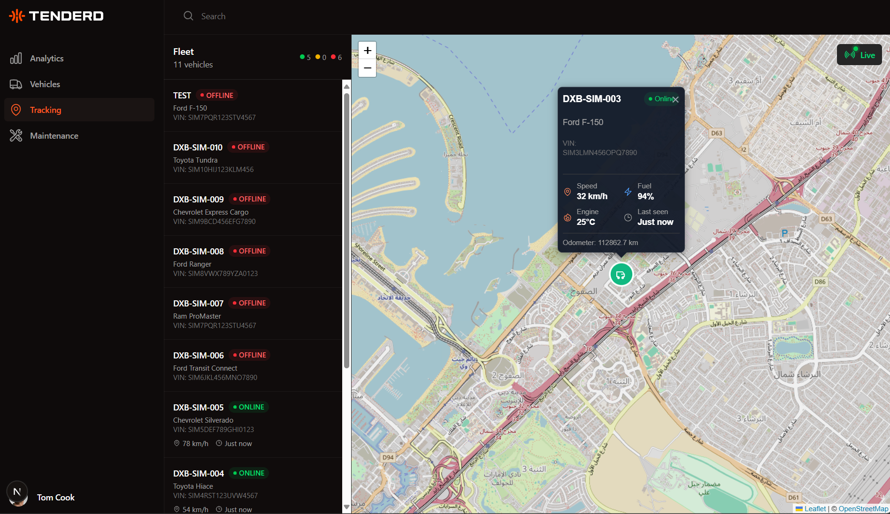
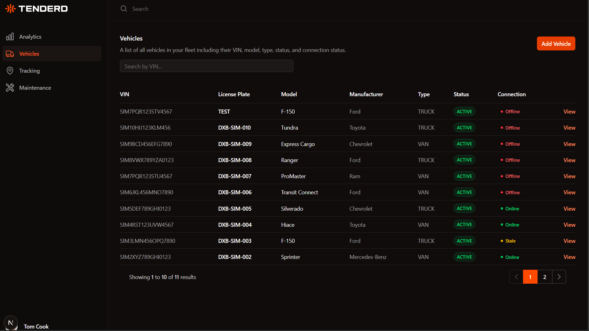
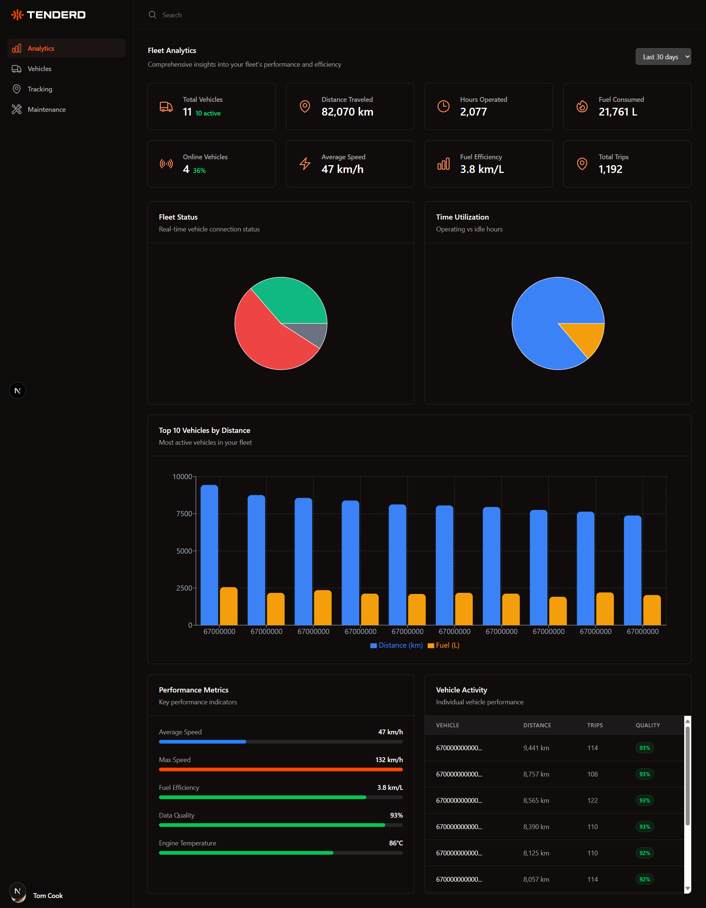
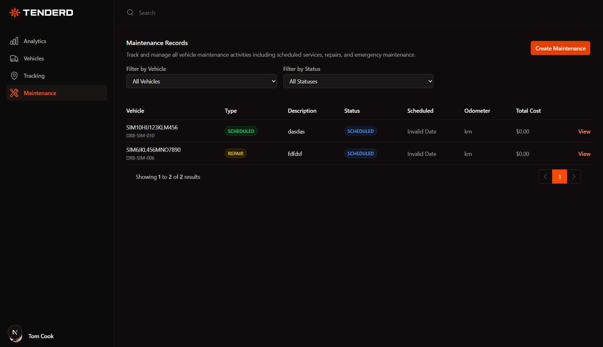
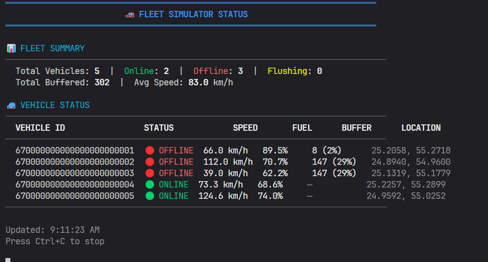

# 🚛 Tenderd Fleet Management System (FMS)

**A modern, real-time fleet management system with IoT integration, offline buffering, and scalable CQRS architecture**

---

## 📋 Table of Contents

- [Documentation](#-documentation)
- [About](#-about)
- [Screenshots](#-screenshots)
- [Features](#-features)
- [Technology Stack](#-technology-stack)
- [System Architecture](#-system-architecture)
- [Quick Start](#-quick-start)
- [Project Structure](#-project-structure)
- [Usage Guide](#-usage-guide)
- [Testing](#-testing)
- [Docker Deployment](#-docker-deployment)
- [Challenges](#-challenges)
- [What I Learned](#-what-i-learned)

---

## 📚 Documentation

### 📂 Module Documentation

Each module has detailed documentation:

- **[apps/api/README.md](apps/api/README.md)** - Backend API architecture, CQRS patterns, endpoints, testing
- **[apps/portal/README.md](apps/portal/README.md)** - Frontend architecture, pages, components, styling
- **[apps/iot-transmitter/README.md](apps/iot-transmitter/README.md)** - IoT simulator, buffering, transmission logic
- **[apps/iot-transmitter/docs/HOW_IT_WORKS.md](apps/iot-transmitter/docs/HOW_IT_WORKS.md)** - Deep dive: offline buffering, physics simulation
- **[libs/core-types/README.md](libs/core-types/README.md)** - Shared types, enums, validators

### 📂 API Documentation

- **Swagger UI**: http://localhost:4000/api-docs (live when API is running)
- **OpenAPI JSON**: http://localhost:4000/api-docs.json

---

## 🎯 About

Tenderd FMS is a comprehensive fleet management system for logistics, construction, and fleet-intensive industries. It provides real-time vehicle tracking, maintenance management, analytics dashboards, and IoT device simulation with intelligent offline buffering.

### Key Highlights

✅ Real-time tracking with WebSocket updates  
✅ Offline-first IoT devices with FIFO buffering (500 items)  
✅ CQRS + Event-Driven Architecture  
✅ MongoDB time-series for optimized telemetry storage  
✅ Contextual data validation (location jumps, anomaly detection)  
✅ Connection monitoring (ONLINE → STALE → OFFLINE)  
✅ Beautiful analytics dashboard with interactive charts

---

## 📸 Screenshots

### 🗺️ Real-time Tracking

Live vehicle tracking with custom markers, and connection status indicators.



### 🚗 Vehicle Management

Vehicle registration, search, filters, and connection status monitoring.



### 📊 Analytics Dashboard

Fleet overview with interactive charts for distance, fuel consumption, and vehicle distribution.



### 🔧 Maintenance Management

Maintenance logging with parts tracking, cost calculation, and history.



### 🛰️ IoT Transmitter Simulation

Real-time fleet simulator with offline buffering, batch transmission, and connection status monitoring.



---

## ✨ Features

### 🚗 Vehicle Management

- Register/manage fleet vehicles (VIN, model, manufacturer, type, fuel)
- Real-time connection status monitoring
- Search by VIN, ID, status, type with pagination
- Current telemetry display (location, speed, fuel)

### 📡 Telemetry Tracking

- Real-time GPS location, speed, fuel, odometer, engine metrics
- Single and batch telemetry ingestion
- Historical queries with date ranges
- Contextual validation (impossible speeds, location jumps, fuel anomalies)

### 🔧 Maintenance Management

- Log maintenance records (routine, repair, inspection)
- Track parts, labor hours, costs (auto-calculated)
- Maintenance history per vehicle
- Status tracking (scheduled, in-progress, completed, cancelled)

### 📊 Analytics

- **Fleet Overview**: Total vehicles, active count, distance, fuel consumed
- **Charts**: Distance trends, fuel consumption, vehicle type distribution
- **Data Quality**: Validation issues, anomalies detected
- Daily/weekly/monthly aggregations

### 🌐 Real-time Map Tracking

- Live vehicle markers on interactive Leaflet map
- Color-coded status (🟢 Online, 🟡 Stale, 🔴 Offline)
- Vehicle path visualization (last hour)
- Animated marker updates via WebSocket
- Real-time toast notifications for status changes

### 🤖 IoT Device Simulation

- Realistic telemetry generation with physics-based GPS routes
- **Offline buffering** with FIFO queue (500 items)
- **Batch transmission** on reconnection (chunks of 50)
- Exponential backoff retry logic
- Simulate multiple vehicles with random offline scenarios

---

## 🛠 Technology Stack

### Backend

- **Runtime**: Node.js 20 + TypeScript
- **Framework**: Express.js
- **Database**: MongoDB (Time-series collections)
- **Real-time**: Socket.IO (WebSocket)
- **Architecture**: CQRS + Event-Driven (Command/Query/Event buses)
- **DI**: TSyringe
- **Validation**: Zod
- **API Docs**: Swagger/OpenAPI
- **Testing**: Jest + mongodb-memory-server
- **Jobs**: node-cron (connection monitoring)

### Frontend

- **Framework**: Next.js 15 + React 19 + TypeScript
- **Styling**: Tailwind CSS (dark mode)
- **Forms**: React Hook Form + Zod
- **Charts**: Recharts
- **Maps**: Leaflet + React-Leaflet
- **WebSocket**: Custom type-safe client library
- **HTTP**: Fetch API with type-safe wrappers

### Infrastructure

- **Monorepo**: pnpm workspaces + Turborepo
- **Shared Libs**: `@tenderd-fms/core-types`, `@tenderd-fms/websocket-client`, `@tenderd-fms/api-client`
- **Containerization**: Docker + Docker Compose

---

## 🏗 System Architecture

```
┌─────────────────────────────────────────────────────────────────┐
│                         IoT Layer                               │
│  Vehicle Simulators (3+) → Local Buffer (FIFO 500) → HTTP       │
└────────────────────────────┬────────────────────────────────────┘
                             │
                             ▼
┌─────────────────────────────────────────────────────────────────┐
│                        Backend Layer                            │
│  Express API (4000) ← CQRS Buses → MongoDB (Time-Series)        │
│  ↓ Command Bus      ↓ Query Bus     ↓ Event Bus                 │
│  Create/Update      Read/List       Telemetry/Offline Events    │
│  Background Jobs: Connection Monitor (30s cron)                 │
└────────────────────────────┬────────────────────────────────────┘
                             │
                             ▼
┌─────────────────────────────────────────────────────────────────┐
│                       Frontend Layer                            │
│  Next.js Portal (3000) ← WebSocket Client → Real-time Updates   │
│  Dashboard → Vehicles → Maintenance → Analytics → Tracking      │
│  Leaflet Map → Custom Markers → Path Visualization              │
└─────────────────────────────────────────────────────────────────┘
```

### Data Flow

**Normal Operation (Online):**

```
Vehicle → HTTP POST → API → Validate → MongoDB → Publish Event → WebSocket → Frontend
(30s interval, real-time updates)
```

**Offline Operation:**

```
Vehicle → Local Buffer → ... → Reconnect → Batch Flush → API → Backfill Data
(No data loss, eventual consistency)
```

**Connection Monitoring:**

```
Background Job (30s) → Check lastSeenAt → Update Status → Emit Events
(Independent detection: ONLINE → STALE → OFFLINE)
```

---

## 🚀 Quick Start

### Prerequisites

- **Node.js** 20+ ([Download](https://nodejs.org))
- **pnpm** 9+ (`npm install -g pnpm`)
- **MongoDB** 6+ (local or Docker)

### 1. Clone & Install

```bash
git clone https://github.com/b3hniya/tenderd-fms.git
cd tenderd-fms
pnpm install
```

### 2. Environment Variables

**`apps/api/.env`:**

```env
PORT=4000
MONGODB_URI=mongodb://localhost:27017/tenderd-fms
NODE_ENV=development
LOG_LEVEL=info
```

**`apps/portal/.env.local`:**

```env
NEXT_PUBLIC_API_URL=http://localhost:4000
```

**`apps/iot-transmitter/.env`:**

```env
API_URL=http://localhost:4000
TRANSMISSION_INTERVAL=30000
VEHICLE_COUNT=3
```

### 3. Start MongoDB

```bash
# Docker (easiest)
docker run -d -p 27017:27017 --name mongodb mongo:6

# Or use local MongoDB installation
mongod --dbpath /path/to/data
```

### 4. Seed Database

```bash
pnpm --filter @tenderd-fms/api seed:vehicles
```

```bash
pnpm --filter @tenderd-fms/api seed:analytics
```

Creates 5 sample vehicles with initial telemetry and maintenance records.

### 5. Start Services

**Terminal 1 - API:**

```bash
pnpm --filter @tenderd-fms/api dev
```

**Terminal 2 - Portal:**

```bash
pnpm --filter @tenderd-fms/portal dev
```

**Terminal 3 - IoT Transmitter:**

```bash
pnpm transmit

# OR
pnpm --filter @tenderd-fms/iot-transmitter start
```

### 6. Access Applications

- **Frontend Dashboard**: http://localhost:3000
- **Backend API**: http://localhost:4000
- **Swagger Docs**: http://localhost:4000/api-docs

---

## 📁 Project Structure

```
tenderd-fms/
├── apps/
│   ├── api/                    # Backend Express API (Port 4000)
│   │   ├── src/
│   │   │   ├── infrastructure/ # CQRS, Event Bus, WebSocket, DI, Jobs
│   │   │   ├── modules/        # vehicle, telemetry, maintenance, analytics
│   │   │   └── shared/         # Events, types
│   │   ├── docs/               # API documentation
│   │   └── README.md           # 📄 See apps/api/README.md
│   │
│   ├── portal/                 # Next.js Frontend (Port 3000)
│   │   ├── app/dashboard/      # tracking, vehicles, maintenance, analytics
│   │   ├── docs/               # Frontend documentation
│   │   └── README.md           # 📄 See apps/portal/README.md
│   │
│   └── iot-transmitter/        # IoT Device Simulator
│       ├── src/
│       │   ├── simulator/      # Physics-based vehicle simulation
│       │   ├── buffer/         # Offline FIFO buffering
│       │   └── api-client/     # HTTP client with retry logic
│       ├── docs/               # IoT simulation deep dive
│       │   └── HOW_IT_WORKS.md # 📄 See apps/iot-transmitter/docs/
│       └── README.md           # 📄 See apps/iot-transmitter/README.md
│
├── libs/
│   ├── core-types/             # Shared types, enums, Zod validators
│   │   └── README.md           # 📄 See libs/core-types/README.md
│   ├── websocket-client/       # Type-safe WebSocket client
│   └── api-client/             # Auto-generated API client
│
├── turbo.json                  # Turborepo config
└── README.md                   # 📄 This file
```

---

## 📖 Usage Guide

### 1️⃣ Register a New Vehicle

**Via Frontend:**

1. Navigate to http://localhost:3000/dashboard/vehicles
2. Click "Add Vehicle" button (top-right)
3. Fill form (VIN, license plate, model, manufacturer, year, type, fuel)
4. Submit

**Via API:**

```bash
curl -X POST http://localhost:4000/api/vehicle \
  -H "Content-Type: application/json" \
  -d '{
    "vin": "1HGBH41JXMN109186",
    "licensePlate": "ABC-1234",
    "model": "Ford F-150",
    "manufacturer": "Ford",
    "year": 2024,
    "type": "TRUCK",
    "fuelType": "DIESEL",
    "status": "ACTIVE"
  }'
```

### 2️⃣ Start IoT Simulator

```bash
pnpm --filter @tenderd-fms/iot-transmitter start
```

**What it does:**

- Loads existing vehicles from database
- Transmits telemetry every 30 seconds
- Simulates realistic GPS routes with physics-based movement
- Randomly simulates offline scenarios (5-20 min)
- Buffers data locally during offline periods
- Batch-flushes buffer on reconnection

### 3️⃣ View Real-time Tracking

1. Open http://localhost:3000/dashboard/tracking
2. See live vehicle markers:
   - 🟢 **Green**: Online (last seen < 60s)
   - 🟡 **Yellow**: Stale (60s - 5min)
   - 🔴 **Red**: Offline (> 5min)
3. Click marker for vehicle details
4. Watch paths update in real-time as telemetry arrives

### 4️⃣ Log Maintenance

**Via Frontend:**

1. Navigate to http://localhost:3000/dashboard/maintenance
2. Click "New Maintenance Record"
3. Select vehicle, type (routine/repair/inspection), description
4. Add parts used (name, quantity, cost)
5. Add labor hours and cost per hour
6. **Cost auto-calculates** (parts + labor)
7. Submit

**Via API:**

```bash
curl -X POST http://localhost:4000/api/maintenance \
  -H "Content-Type: application/json" \
  -d '{
    "vehicleId": "60d5f9b8c8b9a82f4c8e4a1b",
    "type": "REPAIR",
    "description": "Engine oil change",
    "parts": [
      { "name": "Oil Filter", "quantity": 1, "cost": 15.99 },
      { "name": "Engine Oil 5W-30", "quantity": 5, "cost": 8.99 }
    ],
    "laborHours": 1.5,
    "laborCostPerHour": 85.00
  }'
```

### 5️⃣ View Analytics

Navigate to http://localhost:3000/dashboard/analytics:

- **Fleet Overview Cards**: Total vehicles, active count, distance traveled today, fuel consumed today
- **Distance Traveled Chart**: 7-day trend line
- **Fuel Consumption Chart**: Bar chart per vehicle
- **Vehicle Type Distribution**: Pie chart
- **Data Quality Metrics**: Validation issues, anomalies detected

---

## 🧪 Testing

### Run All Tests

```bash
pnpm test
```

### Run Tests for Specific Module

```bash
# API tests
pnpm --filter @tenderd-fms/api test

# Watch mode (auto-rerun on changes)
pnpm --filter @tenderd-fms/api test:watch

# Coverage report
pnpm --filter @tenderd-fms/api test:coverage
```

### Test Coverage

**Current: 83+ unit tests**

- **Vehicle Module**: 15 tests (CreateVehicle, GetAllVehicles, GetVehicleById)
- **Telemetry Module**: 30 tests (SaveTelemetry, SaveTelemetryBatch, validation logic)
- **Maintenance Module**: 20 tests (Create, Update, GetHistory, GetById)
- **Analytics Module**: 10 tests (CalculateDailyAnalytics, GetFleetAnalytics, GetVehicleAnalytics)
- **Connection Monitoring**: 8 tests (offline detection, status transitions, event emission)

---

## 🚧 Challenges

### Challenge 1: Real-time Updates at Scale

**Problem**: WebSocket broadcasts could overwhelm clients (30s × 100 vehicles = 200+ events/min)

**Solution**:

- Event aggregation in frontend (debounced updates)
- Socket.IO rooms for selective broadcasting
- MongoDB indexes on `vehicleId` + `timestamp`

### Challenge 2: Offline Buffering Reliability

**Problem**: IoT devices lose connection, risking data loss

**Solution**:

- FIFO buffer (500 items) in IoT transmitter
- Batch transmission (chunks of 50) on reconnection
- Exponential backoff retry logic (2s, 4s, 8s)
- Time-series collection preserves order

### Challenge 3: Contextual Validation Complexity

**Problem**: Raw telemetry can be invalid (GPS jumps, fuel drops)

**Solution**:

- Multi-layer validation:
  1. **Schema** (Zod): Type safety, ranges
  2. **Contextual**: Compare with last telemetry (location distance, odometer monotonicity)
  3. **Flag suspicious data** instead of rejecting (preserve for analysis)

### Challenge 4: Monorepo Type Safety

**Problem**: Sharing types between API, Portal, IoT without duplication

**Solution**:

- `@tenderd-fms/core-types` library:
  - Entity types (Vehicle, Telemetry, Maintenance)
  - Enums (VehicleType, ConnectionStatus, MaintenanceType)
  - Zod validators (shared validation logic)
- pnpm workspace protocol for type-safe imports

### Challenge 5: Connection Status Detection

**Problem**: Detecting when a vehicle goes offline without polling

**Solution**:

- Background job (node-cron) runs every 30s
- Tracks `lastSeenAt` per vehicle
- State machine:
  - **0-60s**: ONLINE
  - **60s-5min**: STALE (warning)
  - **5min+**: OFFLINE (alert)
- Publishes `VehicleOfflineEvent` / `VehicleReconnectedEvent`

---

## 🎓 What I Learned

### Technical Skills

- **CQRS Pattern**: Separated read/write operations for clarity and testability
- **Event-Driven Architecture**: Decoupled modules via events (broadcast, analytics updates)
- **Time-Series Data**: MongoDB time-series collections (6x compression, optimized queries)
- **WebSocket at Scale**: Socket.IO rooms, connection state management, reconnection logic
- **Dependency Injection**: TSyringe simplified testing with mock injection
- **Monorepo Management**: Turborepo + pnpm enabled efficient code sharing

### Architecture Decisions

- **Why CQRS?**: Optimized queries don't need command validation overhead
- **Why Event Bus?**: Enables future features (alerts, notifications) without modifying existing code
- **Why Time-Series?**: 6x storage savings + optimized range queries
- **Why Offline Buffer?**: Critical for IoT reliability in poor network conditions

### Best Practices

- **Immutable Telemetry**: Never modify historical data, always append (time-series)
- **Validation Layers**: Schema → Contextual → Business rules (defense in depth)
- **Type Safety**: Shared types prevent runtime errors across services
- **Testing Strategy**: Unit tests for logic, integration tests for workflows

### Soft Skills

- **Domain Modeling**: Understood fleet management domain (vehicles, telemetry, maintenance, analytics)
- **Problem Decomposition**: Broke complex assignment into 20+ testable tasks
- **Documentation**: Clear docs reduce onboarding time (README, Swagger, inline comments)

---

## 🤝 Contributing

This project was built as a technical assignment for **Tenderd**. The architecture and patterns can serve as a reference for:

- CQRS implementation in Node.js + TypeScript
- Event-driven microservices with Socket.IO
- IoT device simulation with offline buffering
- Real-time tracking with Leaflet maps
- Monorepo structure with shared types

---

## 📄 License

MIT License

---

## 🙏 Acknowledgments

- **Tenderd Team** for the challenging and well-designed assignment
- **MongoDB** time-series collections for efficient telemetry storage
- **Socket.IO** for reliable WebSocket infrastructure
- **Leaflet** for beautiful map rendering
- **Community** for open-source tools

---

<div align="center">

**Built with ❤️ for Tenderd**

[⬆ Back to Top](#-tenderd-fleet-management-system-fms)

</div>
